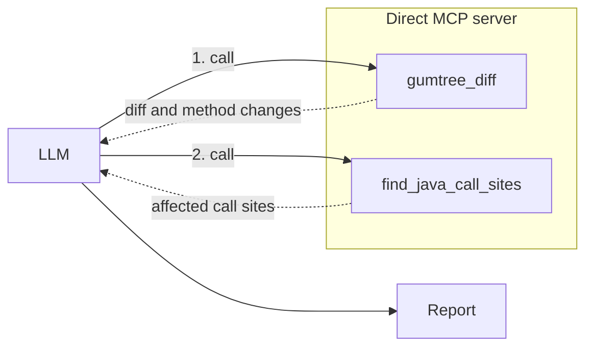
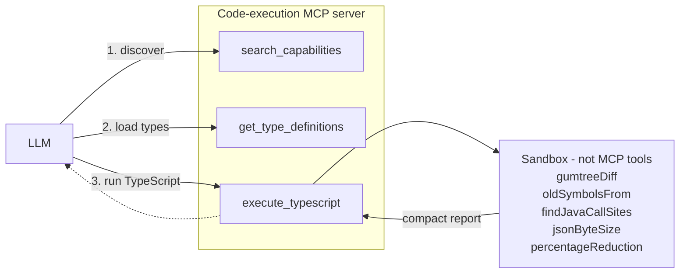

# Smart Orchestrator PoC

**Code-executed tool orchestration for Java dependency-upgrade analysis.**

## Direct calls vs code execution

### Direct MCP

### Code-execution MCP

## Results
Two approaches: Direct mcp vs code execution mcp:

- **Direct tools:** the raw diff and call-site results pass through the LLM.
- **Code execution:** intermediate results stay in the sandbox; only the report returns to the LLM.

| Approach | Data transferred | Tool calls |
|---|---:|---:|
| Direct tools | 11,103 B | 2 |
| Code execution | 7,118 B | 3 |

Code execution transfers **35.89% less data** and uses one extra cold-start call in this very simple benchmark.
